# 📸 Project Screenshots

A visual tour of the Azure 3-Tier Web Application — architecture, configuration, data layer, security, CI/CD, and the live app itself.

Click any section below to expand and view the screenshot.

---

## 🏗️ Architecture

<strong>System architecture diagram</strong>

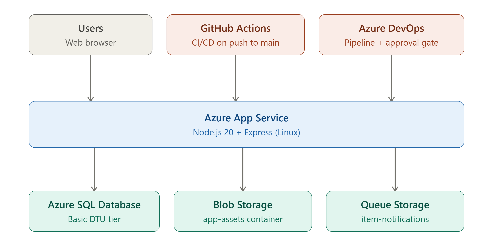

Users and two CI/CD pipelines — GitHub Actions and Azure DevOps — both deploy to Azure App Service, which connects to Azure SQL Database, Blob Storage, and Queue Storage.

---

## ☁️ Azure Resources

<strong>Resource group — all provisioned resources</strong>

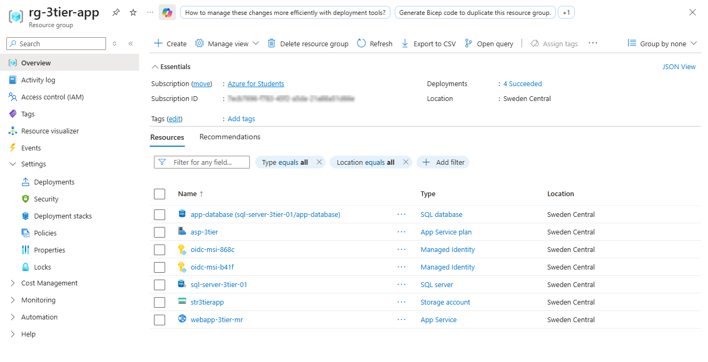

All resources in `rg-3tier-app`, Sweden Central: App Service, App Service Plan, SQL Server + Database, Storage Account, and two Managed Identities used by Azure DevOps.

<strong>App Service overview</strong>

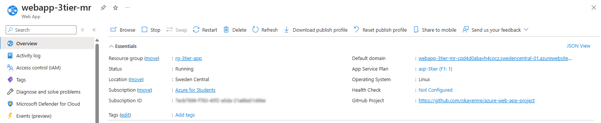

`webapp-3tier-mr` — Linux, F1 Free tier, connected to the GitHub repository for continuous deployment.

<strong>Environment variables</strong>

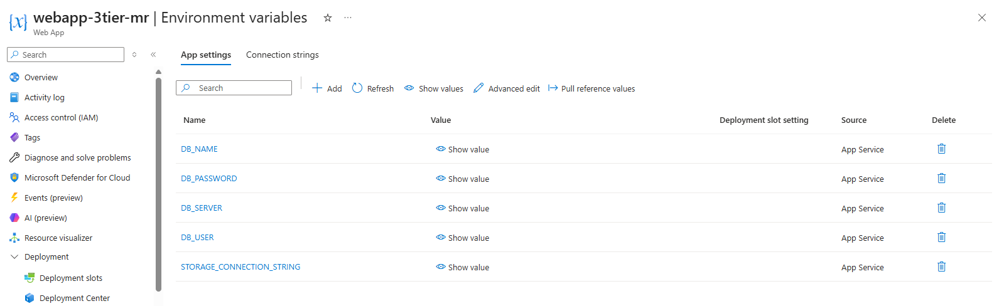

All secrets — database credentials and the storage connection string — are stored as App Service environment variables, never in source code. Values are hidden in this view.

---

## 🗄️ Data & Storage

<strong>Azure SQL — query editor</strong>

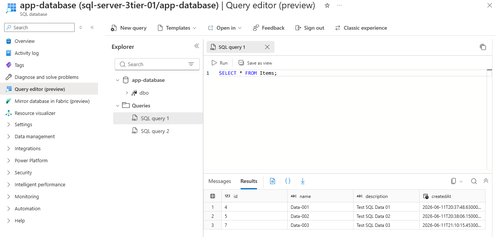

Running `SELECT * FROM Items` directly against `app-database` using the Azure Portal Query Editor.

<strong>SQL firewall rules</strong>

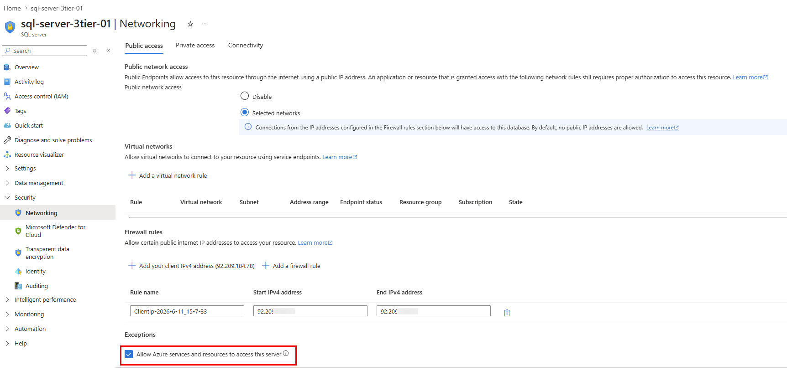

"Allow Azure services and resources to access this server" is enabled, so App Service can reach the database without exposing it to the public internet.

<strong>Blob Storage — app-assets container</strong>

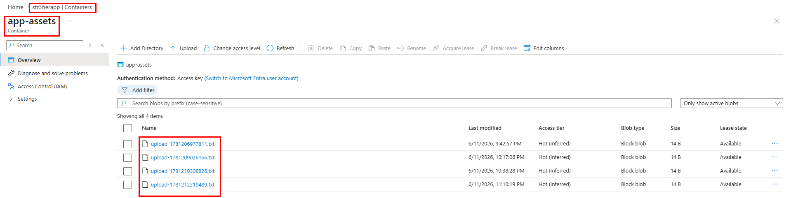

Uploaded files are stored in the private `app-assets` container inside the `str3tierapp` storage account.

<strong>Queue Storage — item-notifications</strong>

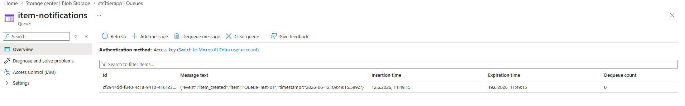

Every new item creates a JSON message in the `item-notifications` queue — the async, decoupled notification layer.

---

## 🔐 Security & Access

<strong>RBAC — role assignments</strong>

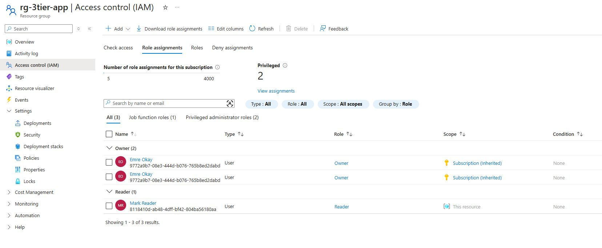

Access control for `rg-3tier-app`: Owner roles plus a Reader role assigned via Microsoft Entra ID.

---

## ⚙️ CI/CD Pipelines

<strong>Azure DevOps — pipeline run</strong>

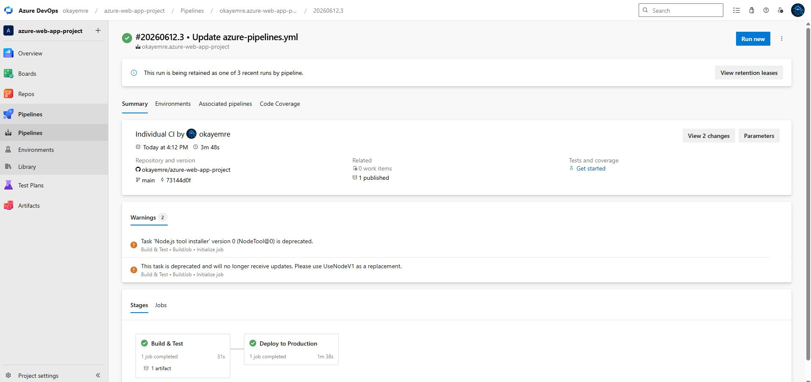

A multi-stage pipeline: Build & Test, then Deploy to Production — gated behind a manual approval step.

<strong>Azure DevOps — service connection</strong>

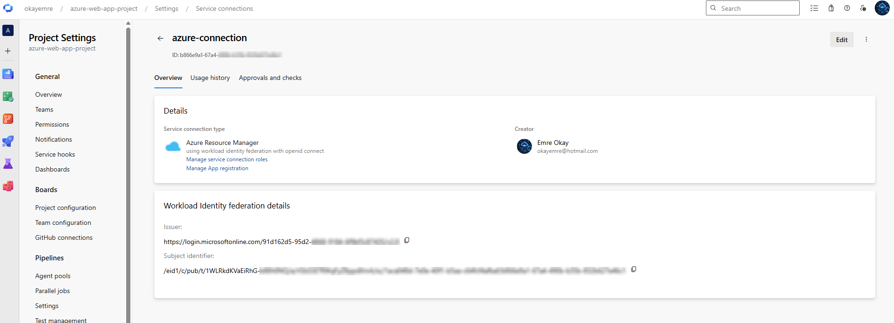

`azure-connection` — an Azure Resource Manager service connection authenticated via Workload Identity Federation, with no stored passwords or secrets.

---

## 🖥️ Live Application

<strong>Application dashboard</strong>

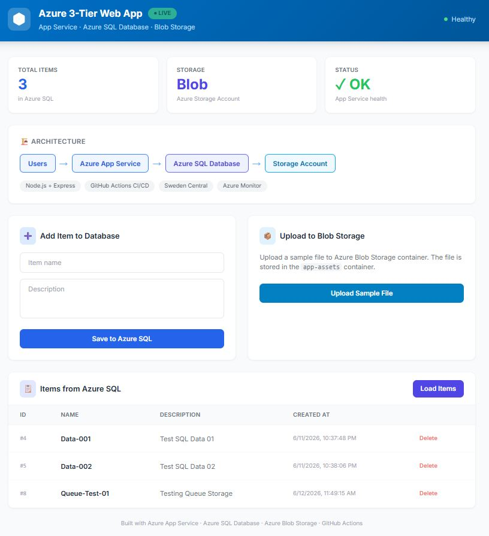

The deployed application: live health status, architecture summary, item form, file upload, and real data from Azure SQL.

---

[← Back to main README](../../README.md)
